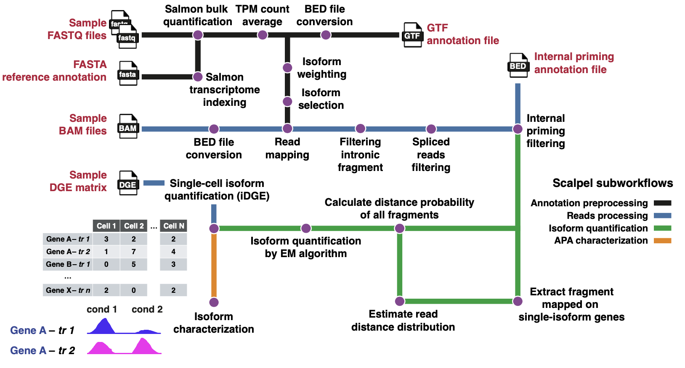

<h1>
  <picture>
    <source media="(prefers-color-scheme: dark)" srcset="docs/images/nf-core-scalpel_logo_dark.png">
    
  </picture>
</h1>

[](https://www.nf-test.com)
[](https://www.nextflow.io/)
[](https://github.com/nf-core/tools/releases/tag/3.4.1)
[](https://docs.conda.io/en/latest/)
[](https://www.docker.com/)
[](https://sylabs.io/docs/)
[](https://cloud.seqera.io/launch?pipeline=https://github.com/plasslab/nf-core-scalpel)

[](https://nfcore.slack.com/channels/scalpel)
[](https://bsky.app/profile/nf-co.re)
[](https://mstdn.science/@nf_core)
[](https://www.youtube.com/c/nf-core)

## Introduction

**nf-core/scalpel** is a bioinformatics pipeline for transcript isoform quantification and alternative polyadenylation (APA) characterization from 3'-tagged single-cell RNA-seq data. It takes paired-end FASTQ files together with pre-computed Cell Ranger outputs, a genome FASTA, a transcriptome FASTA, a GTF annotation, and an internal priming reference track. The pipeline selects representative transcript isoforms, maps reads to them, filters internal priming artifacts, and produces single-cell isoform-resolved digital gene expression (DGE) matrices.

The pipeline is built using [Nextflow](https://www.nextflow.io) DSL2 and consists of three main subworkflows:

1. **Annotation Processing** — Builds a Salmon index, quantifies transcript abundance across samples, averages TPM values, and selects/collapses representative isoforms based on 3'-end profiles.
2. **Reads Processing** — Converts Cell Ranger BAM files to BED format, maps reads to annotated transcripts, and filters internal priming events using a reference track.
3. **Isoform Quantification** — Computes read-to-isoform probability distributions, runs an Expectation-Maximization (EM) algorithm per cell, and generates final DGE count matrices.

\

<div align="center">
  
</div>

## Usage

> [!NOTE]
> If you are new to Nextflow and nf-core, please refer to [this page](https://nf-co.re/docs/usage/installation) on how to set-up Nextflow. Make sure to [test your setup](https://nf-co.re/docs/usage/introduction#how-to-run-a-pipeline) with `-profile test` before running the workflow on actual data.

### Samplesheet input

First, prepare a samplesheet with your input data that looks as follows:

`samplesheet.csv`:

```csv
sample,fastq_1,fastq_2,cranger_path
SRR6129050,/path/to/SRR6129050_S1_L001_R1_001.fastq.gz,/path/to/SRR6129050_S1_L001_R2_001.fastq.gz,/path/to/cellranger/SRR6129050
SRR6129051,/path/to/SRR6129051_S1_L001_R1_001.fastq.gz,/path/to/SRR6129051_S1_L001_R2_001.fastq.gz,/path/to/cellranger/SRR6129051
```

| Column         | Description                                                                 |
| -------------- | --------------------------------------------------------------------------- |
| `sample`       | Unique sample identifier (no spaces).                                       |
| `fastq_1`      | Path to R1 FASTQ file (`.fastq.gz`).                                       |
| `fastq_2`      | Path to R2 FASTQ file (`.fastq.gz`).                                       |
| `cranger_path` | Path to the Cell Ranger output directory for the corresponding sample.      |

### Running the pipeline

```bash
nextflow run nf-core/scalpel \
   -profile <docker/singularity/.../institute> \
   --samplesheet samplesheet.csv \
   --genome /path/to/genome.fa \
   --transcriptome /path/to/transcriptome.fa \
   --gtf /path/to/annotation.gtf \
   --ip_reference /path/to/ip_reference.track.gz \
   --outdir <OUTDIR>
```

### Optional parameters

| Parameter              | Default      | Description                                                       |
| ---------------------- | ------------ | ----------------------------------------------------------------- |
| `--sequencing_platform`| `chromium`   | Sequencing platform (`chromium` or `dropseq`).                    |
| `--barcodes_whitelist` | `null`       | CSV file mapping samples to custom barcode whitelist files.        |
| `--distance_profile`   | `600`        | Distance threshold for 3'-end profile-based isoform collapsing.   |
| `--distance_3end`      | `50`         | Distance threshold for 3'-end merging.                            |
| `--distance_ip`        | `60`         | Distance threshold for internal priming filtering.                |
| `--gene_fraction`      | `98%`        | Gene fraction threshold for isoform quantification.               |
| `--binsize`            | `20`         | Bin size for probability distribution computation.                |
| `--libtype`            | `A`          | Salmon library type (automatic detection by default).             |

### Reference files

SCALPEL requires an internal priming (IP) annotation file. Pre-built references are available:

- [Mouse IP annotation (mm10)](https://zenodo.org/records/15664563/files/mm10_polya.track.tar.gz?download=1)
- [Human IP annotation (GRCh38)](https://zenodo.org/records/15717592/files/hg38_ipriming_sites.bed.tar.gz?download=1)
- [GENCODE annotations](https://www.gencodegenes.org/) — for genome FASTA, transcriptome FASTA, and GTF files

> [!WARNING]
> Please provide pipeline parameters via the CLI or Nextflow `-params-file` option. Custom config files including those provided by the `-c` Nextflow option can be used to provide any configuration _**except for parameters**_; see [docs](https://nf-co.re/docs/usage/getting_started/configuration#custom-configuration-files).

For more details and further functionality, please refer to the [usage documentation](https://nf-co.re/scalpel/usage) and the [parameter documentation](https://nf-co.re/scalpel/parameters).

## Pipeline output

The pipeline produces the following output directories:

| Directory          | Description                                                        |
| ------------------ | ------------------------------------------------------------------ |
| `salmon/`          | Salmon quantification results (transcript-level TPM).              |
| `transcript/`      | Selected and collapsed transcript annotations.                     |
| `bed/`             | BED files from BAM-to-BED conversion.                              |
| `reads/`           | Transcript-mapped and filtered reads.                              |
| `ip/`              | Internal priming filtering results.                                |
| `probability/`     | Read-to-isoform probability distributions.                         |
| `fragment/`        | Fragment-level probability assignments.                            |
| `cell/`            | Per-cell grouped fragment probabilities.                           |
| `em/`              | EM algorithm output (isoform quantification per cell).             |
| `dge/`             | Digital gene expression count matrices per sample.                 |
| `isoform/`         | Isoform selection summary statistics.                              |
| `pipeline_info/`   | Execution reports, timelines, and software versions.               |

For more details about the output files and reports, please refer to the
[output documentation](https://nf-co.re/scalpel/output).

### Downstream analysis

For tutorials on working with SCALPEL output:

- [10X Chromium scRNA-seq example](https://raw.githack.com/plasslab/SCALPEL/refs/heads/dev/docs/chromium.html)
- [Drop-seq scRNA-seq example](https://raw.githack.com/plasslab/SCALPEL/refs/heads/dev/docs/dropseq.html)
- [10X Chromium downstream analysis](https://raw.githack.com/plasslab/SCALPEL/refs/heads/dev/docs/chromium_downstream.html)
- [Drop-seq downstream analysis](https://raw.githack.com/plasslab/SCALPEL/refs/heads/dev/docs/dropseq_downstream.html)

## Credits

nf-core/scalpel was originally written by Franz AKE.

We thank the following people for their extensive assistance in the development of this pipeline:

- Marcel Schilling
- Sandra M. Fernández-Moya
- Akshay Jaya Ganesh
- Ana Gutiérrez-Franco
- Lei Li
- Mireya Plass

## Contributions and Support

If you would like to contribute to this pipeline, please see the [contributing guidelines](.github/CONTRIBUTING.md).

For further information or help, don't hesitate to get in touch on the [Slack `#scalpel` channel](https://nfcore.slack.com/channels/scalpel) (you can join with [this invite](https://nf-co.re/join/slack)).

## Citations

If you use nf-core/scalpel for your analysis, please cite:

> Franz Ake, Marcel Schilling, Sandra M. Fernández-Moya, Akshay Jaya Ganesh, Ana Gutiérrez-Franco, Lei Li, Mireya Plass.
> **Quantification of transcript isoforms at the single-cell level using SCALPEL.**
> _Nat Commun_ 16, 6402 (2025). doi: [10.1038/s41467-025-61118-0](https://doi.org/10.1038/s41467-025-61118-0)

An extensive list of references for the tools used by the pipeline can be found in the [`CITATIONS.md`](CITATIONS.md) file.
